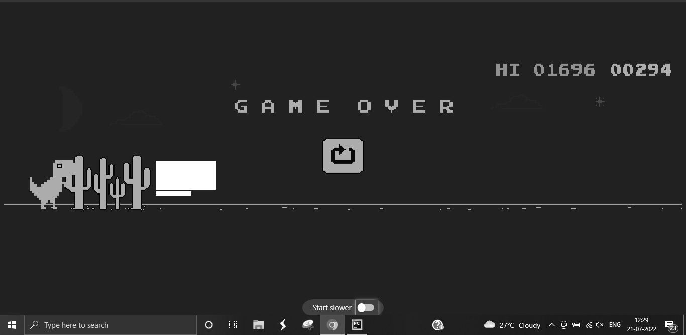

# Automation of Chrome's Dino Game using Python
Automation of google chrome's famous dino game that you can play at the following url in your Google Chrome Browser: chrome://dino

  The program uses pyautogui and pillow library for automatic keypresses and image processing.  
  <b>Note: </b> You will need to change the coordinates that fit to your screen size. 
  Just detect obstacles far enough so that you don't jump only when you get close to it.

<h2> Step 1: Setting Up Imports and Grabbing the Image </h2>

  Use time module to pause program execution for 3 seconds. In these 3 seconds you must open the chrome tab with dino game open.
  Import the libraries, PyAutoGui and Pillow. Import ImageGrab from Pillow and use grab() method to take a screenshot of the image. Then convert it to a black and
  white image using convert('L') method.
  Use load() method to extract image data into a variable. Use show() method to view the screenshot taken by the program.

<h2> Step 2: Decide the right distance to Jump </h2>

  Once you have take the image, remember the coordinates work such that the top-left corner is (0,0). Moving from this to right side of screen is adding x coordinates
  and moving down is adding y coordinates. Thus (10,10) will be closer to top-left than (20,20). Now depending on your screen size, decide the right distance between
  the dinosaur and an obstacle. If an obstacle comes in this distance, then dinosaur will be made to jump or duck. Use nested for loops with range method to draw a
  rectangle at that spot using image[i, j] = (color value in integer). You will need to play the game yourself multiple times to decide on this distance.  
  It is suggested that dino should jump as early as possible. In the below image, the lower block to detect cactus, and the upper block it to detect bird. Remember 
  that cactus block should not be too below otherwise you will detect all the bumps in the ground and jump unnecessarily.
  

    
  

<h2> Step 3: Making him take Action </h2>

  In the nested loops, once the distance has been decided, check if any image[i, j] is less than or greater than a certain value, 
  then it means that obstacle was detected. Break the loop there and use pyautogui.keyDown('up') to jump and pyautogui.keyDown('down') to duck. 
  Remember that the bird can appear at the position of his head too, so the rectangle to detect bird should be from dino's head to little lower than his belly. 
  The rectangle to detect cactus should be billow that. Now you can remove the show() method as you don't want to view the image for every instance. Wrap all of
  this in a while loop.

